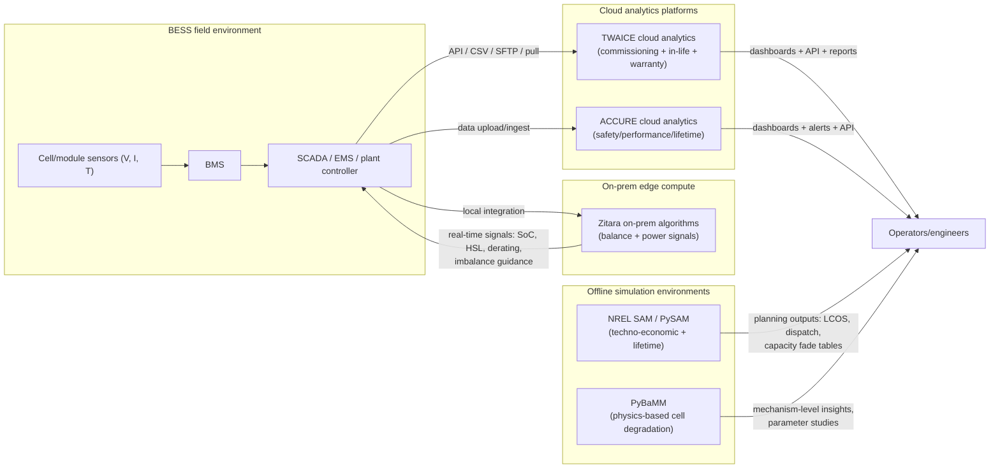

# Public Materials on BESS Simulation and Cell Degradation Modeling for Zitara, ACCURE, and TWAICE

## Executive summary

Publicly accessible information from **zitara.com**, **accure.net**, and **twaice.com** shows three distinct (but overlapping) approaches to "battery modeling" for battery energy storage systems (BESS): (a) **real-time operational digital twins and control signals** (Zitara), (b) **cloud-based predictive analytics and lifetime forecasting** (ACCURE), and (c) **cell-level simulation models plus operational analytics delivered via dashboards/APIs** (TWAICE). The depth of disclosed technical detail varies significantly across the vendors. 

**Most explicit public model description: TWAICE.** TWAICE publicly states its "battery simulation models" are a **coupled electric–thermal–aging model**, described as a hybrid of an **equivalent-circuit model (ECM)** and a **physics-informed semi-empirical** model, and it discloses a **model portfolio** (base/customized/premium) with parameterization pathways (database-based, customer aging data adaptation, or lab measurement) and typical **3–6 month** cell characterization for a "complete aging model."  
TWAICE also provides unusually concrete **data integration** details in a publicly hosted slide deck (API push, SFTP CSV, pull stack) and "ideal" sampling/measurement requirements for guaranteed analytics accuracy.  
In addition, TWAICE publishes multiple research-page summaries describing ECM parameterization and validation (e.g., ECM RC-element impedance modeling, diffusion/low-frequency approaches, and voltage error improvement claims). 

**ACCURE discloses model categories and internal degradation state variables, but not full equations.** ACCURE's public blog content clearly distinguishes **empirical/data-driven**, **semi-empirical**, **mechanistic**, and **physical-chemical** aging approaches, and states its "mechanistic" approach tracks at least **loss of lithium inventory (LLI)** and **loss of active material** on negative/positive electrodes (LAMNE/LAMPE).  
Operationally oriented posts and solution pages claim strong forecasting performance (e.g., **"more than 96% accuracy for 2-year forecasts"** for its Lifetime Manager offering) and describe a hybrid analytics stack combining **electrochemical + degradation modeling** with **AI pattern recognition** and **cross-fleet learning**, including "typical" recalibration intervals (e.g., every five minutes).  
A publicly accessible PDF attributed to ACCURE describes "model-based safety diagnostics" that "mirror electrochemical relationships," and illustrates tracking **loss of active lithium** over time (including lithium plating context). 

**Zitara is strongest on operational signal construction, balancing observability, and validation-by-backtesting; less explicit on degradation equations.** Zitara's public materials emphasize **on-prem** deployment for BESS, constructing accurate site signals ("cell-to-site"), including **energy/power state estimates parameterized by time and dispatch rate**, and "state-of-balance" outputs used to drive rack-level balancing decisions.  
Zitara does explicitly describe internal battery dynamics relevant to degradation and simulation—e.g., overpotential dependence on SoC, temperature, self-heating, and usage history; simulated internal temperature gradients; and "precise onboard simulations" to predict energy/power/heat and track degradation.  
However, Zitara's publicly available pages do not disclose the underlying mathematical form (ECM vs reduced-order electrochemical vs hybrid) for its core LookAhead/degradation estimators; classification here therefore remains partly inferential and should be verified via technical disclosure or a published validation report. 

**Context tools: NREL SAM and PyBaMM are transparent baselines; OpenEMS is primarily an integration/control layer.** 
NREL's SAM documentation and NREL publications describe battery lifetime modeling in terms of **calendar and cycle degradation**, including **rainflow cycle counting** and empirical degradation tables/curves.  
PyBaMM is an open-source physics-based modeling framework with published documentation and examples of degradation mechanisms (e.g., SEI growth, lithium plating, LAM), making it a high-transparency reference for "cell degradation models," albeit with higher parameterization burden and compute for high-fidelity models.  
OpenEMS provides device/EMS integration, scheduling, and APIs (REST/JSON-RPC/WebSocket) for energy hardware, but it is not positioned as a detailed cell degradation simulation environment. 

## Scope and research approach

The scope is limited to **publicly available** materials that specifically relate to **BESS simulation** and **cell degradation/aging models**, including product pages, blogs, white paper landing pages, research-page summaries, public PDFs, and public documentation on integration/APIs. Content gated behind lead forms (download walls) is treated as **partially accessible**: only the openly visible abstracts, topic lists, or preview text are summarized. 

Research ordering followed the user preference: first **zitara.com**, then **accure.net**, then **twaice.com**. Only after covering these sites were additional primary sources consulted (NREL SAM documentation/papers, PyBaMM docs/papers, OpenEMS docs/repo) to support the comparative analysis and clarify model taxonomy. 

Key term framing used throughout:
- "**BESS simulation**" includes (i) **design-time** cell/module/system simulation and (ii) **operational digital twins** that forecast usable energy/power, thermal response, derating, and lifetime impacts under real dispatch.  
- "**Cell degradation models**" refers to representations capturing calendar/cycle aging drivers and internal degradation modes (LLI, LAM, resistance/impedance growth, plating/SEI dynamics), whether physics-based, ECM-based with aging submodels, semi-empirical, or data-driven. 

## Source inventory with direct links and citation lines

The table below lists the highest-relevance public sources used in this report. URLs are provided as direct links (in code), and each entry includes a suggested citation line suitable for an explainer.

| Area | Source | What it contains for BESS simulation & degradation | Direct link | Suggested citation line |
|---|---|---|---|---|
| Zitara | Zitara Power product page | Predictive energy/power estimates "parameterized by time and dispatch rate"; trading/telemetry signals (SoC, HSL).  | `https://www.zitara.com/products/power` | Zitara. (n.d.). *Zitara Power*. Retrieved 2026-03-16. |
| Zitara | Zitara Balance product page | On-prem "state-of-balance algorithm"; inputs: V/I/T; outputs: rack/string imbalance signals.  | `https://www.zitara.com/products/balance` | Zitara. (n.d.). *Zitara Balance*. Retrieved 2026-03-16. |
| Zitara | Validation + mechanism notes for Zitara Balance | Validation approach using inferred "ground truth" and simulated-real-time backtesting; outputs include state-of-balance + "unavailable energy."  | `https://www.zitara.com/resources/estimating-imbalance-is-critical-how-do-we-know-our-signals-are-accurate` | Zitara Engineering. (n.d.). *Estimating imbalance is critical…* Retrieved 2026-03-16. |
| Zitara | Overpotential + simulation examples | Zitara Studio simulations of overpotential; dependence on current, SoC, temperature, self-heating, usage history; internal temp gradient and thermal equilibration example.  | `https://www.zitara.com/resources/algorithm-accuracy-is-essential-part-1` | Srinivasan, S. (2024-01-04). *Accurate battery state of charge readings*. Zitara. Retrieved 2026-03-16. |
| Zitara | Degradation tracking via onboard simulations | "Precise onboard simulations" predicting energy/power/heat and tracking degradation; actionable insights to minimize future degradation.  | `https://www.zitara.com/resources/lithium-ion-battery-degradation` | Zitara. (2025-04-29). *Lithium-ion battery degradation rate*. Retrieved 2026-03-16. |
| Zitara | BMS explainer with Zitara Live claims | "Model-based algorithms" predicting energy/power/degradation; fleet-wide monitoring; dynamic tightening thresholds; customization emphasis.  | `https://www.zitara.com/resources/battery-management-system` | Zitara. (2024-02-23). *What is a battery management system (BMS)?* Retrieved 2026-03-16. |
| ACCURE | Lifetime Manager page | "More than 96% accuracy for 2-year forecasts"; warranty term monitoring (T bands, cycles, C-rates).  | `https://www.accure.net/battery-analytics-solutions/lifetime-manager` | ACCURE. (n.d.). *Lifetime Manager*. Retrieved 2026-03-16. |
| ACCURE | Mechanistic modeling blog | Definitions of empirical/semi-empirical/mechanistic/physical-chemical; mechanistic tracks LLI, LAMNE, LAMPE.  | `https://www.accure.net/blogs/mechanistic-modeling-battery-aging` | Kuipers, M. (n.d.). *Mechanistic modeling in batteries to influence lifetime*. ACCURE. Retrieved 2026-03-16. |
| ACCURE | BMS data unlocking blog | "Minimum viable dataset" guidance; building digital twins from OCV + impedance; cloud computing for safety/performance/aging predictions.  | `https://www.accure.net/blogs/unlocking-unused-bms-battery-data` | ACCURE. (n.d.). *BMS battery data unlocked*. Retrieved 2026-03-16. |
| ACCURE | SOC correction + revenue article | ±2% SOC claim; hybrid stack: electrochemical + degradation modeling + AI + cross-fleet learning; recalibration cadence (≈5 min).  | `https://www.accure.net/blogs/how-sharper-soc-accuracy-can-lift-bess-revenue-by-11` | ACCURE. (n.d.). *Sharper SOC accuracy can lift BESS earnings…* Retrieved 2026-03-16. |
| ACCURE | Safety diagnostics PDF | Model-based safety diagnostics; tracks loss of active lithium; lithium plating context; no extra hardware claim.  | `https://static1.squarespace.com/static/656490ad16f3431c6a4e6eab/t/65f98c8a30f92d091a375cac/1710853260379/61657bbd3259a55ab7bd3d4f_Accure%2BWhite%2BPaper%2B1%2BEN%2B13.pdf` | ACCURE. (n.d.). *Predictive diagnostics to improve battery safety* (White paper). Retrieved 2026-03-16. |
| ACCURE | LFP SOC accuracy white paper landing | Claims/outline: near real-time SOC within ±2% using cloud analytics; why BMS falls short.  | `https://www.accure.net/white-papers/white-paper-soc-accuracy` | ACCURE. (n.d.). *Overcoming SOC inaccuracies in LFP batteries* (White paper landing page). Retrieved 2026-03-16. |
| TWAICE | Battery simulation models product page | Explicit modeling approach (ECM + physics-informed semi-empirical); parameterization modes; 3–6 month aging model characterization; "cell-level standard"; some module effects.  | `https://www.twaice.com/products/battery-simulation-models` | TWAICE. (n.d.). *Battery simulation models*. Retrieved 2026-03-16. |
| TWAICE | "New generation of aging models" update | "Physics-motivated semi-empirical aging models"; mentions OCV aging, degradation modes, swelling force (topic list).  | `https://www.twaice.com/product-updates/a-new-generation-of-aging-models-for-lithium-ion-batteries` | TWAICE. (2023-08-17). *A new generation of aging models for lithium-ion batteries*. Retrieved 2026-03-16. |
| TWAICE | Energy storage analytics whitepaper page | Drivers of aging (temperature, C-rate, SoC, DoD); rationale for analytics and lifetime risk management.  | `https://www.twaice.com/whitepaper/energy-storage-analytics` | TWAICE. (n.d.). *Energy storage analytics* (White paper page). Retrieved 2026-03-16. |
| TWAICE | Digital commissioning/in-life analytics article | KPIs (capacity, RTE, DCR) from string-level data; dashboard + API outputs.  | `https://www.twaice.com/product-updates/de-risk-deployment-operations-of-energy-storage-systems` | TWAICE. (2023-03-27). *De-risk deployment & operations of BESS*. Retrieved 2026-03-16. |
| TWAICE | Public slide deck on data integration | API push / CSV SFTP / pull stack; ideal data resolution & time resolution; metadata needs.  | `https://www.sandia.gov/app/uploads/sites/163/2023/06/2023ESSRF_Session2.5_Franks_Ryan.pdf` | Franks, R. (2023-06-05). *Battery analytics for ESS failure prediction…* (Slides). Retrieved 2026-03-16. |
| TWAICE | Impedance research page summary | Online impedance estimation; ECM RC element parameterization; microcontroller constraints; access to ScienceDirect article.  | `https://www.twaice.com/research/impedance-research-paper` | TWAICE. (n.d.). *Impedance research paper* (summary page). Retrieved 2026-03-16. |
| TWAICE | EIS + time-domain parameterization research | DRT-based approach; ECM parameter derivation; validation and % improvement; links to MDPI.  | `https://www.twaice.com/research/combining-eis-and-time-domain-data` | TWAICE. (n.d.). *Combining EIS and time-domain data* (summary page). Retrieved 2026-03-16. |
| NREL SAM | SAM battery life help page | Defines calendar vs cycle degradation; battery life model options.  | `https://samrepo.nrelcloud.org/help/battery_life.html` | NREL. (n.d.). *SAM help: Battery life*. Retrieved 2026-03-16. |
| NREL SAM | NREL "How to model batteries…" (2025) | Lifetime models; rainflow; "sum of cycle and calendar models" note (change as of 2024-12-12); chemistry notes.  | `https://docs.nrel.gov/docs/fy25osti/93555.pdf` | NREL. (2025-05-15). *How to model batteries in SAM and PySAM*. Retrieved 2026-03-16. |
| NREL SAM | Technoeconomic modeling paper (2015) | Battery models; rainflow counting; lifetime table inputs example; validation framing.  | `https://docs.nrel.gov/docs/fy15osti/64641.pdf` | DiOrio, N., et al. (2015). *Technoeconomic modeling of battery energy storage in SAM*. NREL. Retrieved 2026-03-16. |
| PyBaMM | PyBaMM JORS paper | Core design philosophy, citation, and BSD-3-Clause license.  | `https://openresearchsoftware.metajnl.com/articles/10.5334/jors.309` | Sulzer, V., et al. (2021). *Python Battery Mathematical Modelling (PyBaMM).* JORS. |
| PyBaMM | Coupled degradation notebook | Degradation mechanisms (SEI, plating, cracks) and LLI contributions.  | `https://docs.pybamm.org/en/latest/source/examples/notebooks/models/coupled-degradation.html` | PyBaMM Team. (n.d.). *Coupled degradation mechanisms* (docs notebook). Retrieved 2026-03-16. |
| PyBaMM | Loss of active material notebook | LAM submodels; stress-driven LAM reference path; DFN + SEI examples.  | `https://docs.pybamm.org/en/latest/source/examples/notebooks/models/loss_of_active_materials.html` | PyBaMM Team. (n.d.). *Loss of active material submodels* (docs notebook). Retrieved 2026-03-16. |
| OpenEMS | OpenEMS Edge architecture | EMS input-process-output framing; control algorithms derive setpoints; edge context.  | `https://openems.github.io/openems.io/openems/latest/edge/architecture.html` | OpenEMS. (n.d.). *Edge architecture*. Retrieved 2026-03-16. |
| OpenEMS | REST API controller docs | REST/JSON-RPC external access; default port/base URL pattern; endpoints.  | `https://openems.github.io/openems.io/openems/latest/edge/controller.html` | OpenEMS. (n.d.). *Controller: REST-Api controller*. Retrieved 2026-03-16. |
| OpenEMS | GitHub repository + license | Open-source EMS stack; licenses (AGPL-3.0, EPL-2.0).  | `https://github.com/OpenEMS/openems` | OpenEMS. (n.d.). *OpenEMS/openems* (source code). Retrieved 2026-03-16. |
| Background | Review of Li-ion degradation modes | Canonical mapping from mechanisms → degradation modes incl. LLI, LAM, impedance change.  | `https://pubs.rsc.org/en/content/articlehtml/2022/cp/d2cp00417h` | O'Kane, S. E. J., et al. (2022). *Lithium-ion battery degradation: how to model it*. PCCP. |

## Company public materials and what they imply technically

### Zitara

Zitara's public BESS-facing materials are primarily framed as **on-premise operational software** that improves **signal accuracy** (SoC/SoE/SoP-like capabilities, "HSL") and enables **balancing decisions** and **dispatch planning**. The clearest BESS "simulation" theme in Zitara's materials is **forward-looking state estimation** ("predictive energy and power estimates") and **LookAhead-style prediction** under expected loads, rather than offline cell design simulation. 

**Product surfaces tied to modeling**
- **Zitara Power**: Zitara states its estimates are **predictive** and "parameterized by both time and dispatch rate," explicitly tying the signal to a functional relationship among time, power level, and available energy—this is a strong indicator of a model-based forecast that captures rate-dependent limitations (e.g., voltage/overpotential constraints) rather than static SoC lookup.  
- **Zitara Balance**: Zitara positions balancing as a **state-of-balance algorithm** operated on-prem, consuming cell-level telemetry already present in BESS (voltage/current/temperature) and outputting rack/string imbalance signals that drive prioritization and downtime avoidance. 

**Degradation and internal-physics language**
Zitara's degradation content includes explicit descriptions of degradation mechanisms (e.g., SEI growth as a primary calendar-aging side reaction) and operating-condition drivers (temperature, high current rates, cold-fast-charge conditions).  
On the product side, Zitara claims "precise onboard simulations" can predict **energy, power, and heat generation** "now and into the future," enabling "comprehensive degradation tracking and performance predictions," and that degradation estimation can be used to adjust usage patterns to reduce future degradation. 

**Publicly described validation approach for imbalance modeling**
A notable, relatively technical disclosure is Zitara's description of validating imbalance estimation: it describes creating a high-fidelity baseline inference under "ideal conditions" (verified time windows), then running **data-based backtests** where the algorithm is constrained to "simulated real time" without foresight.  
This is a meaningful public hint about methodology (retrospective validation + backtesting), but it does not disclose the underlying state-space or electrochemical/ECM structure.

**What can be said about model type from public info**
Zitara repeatedly uses "model-based algorithms," "precise onboard simulations," and shows simulation outputs for **overpotential** dynamics and internal thermal gradients (suggesting at least an electric-thermal dynamic model).  
However, Zitara does not publicly label these models as ECM vs reduced-order electrochemical vs purely data-driven; a conservative classification from public text is **hybrid/model-based electric–thermal state estimation**, with degradation tracking possibly implemented via learned or semi-empirical mappings layered on state estimates (inference). 

### ACCURE

ACCURE's public materials are strongly focused on **cloud-based predictive analytics** for BESS and EV fleets, with explicit treatment of **aging model taxonomy**, **lifetime forecasting**, **SOC correction (especially LFP)**, and **data requirements** for meaningful analytics. 

**Model taxonomy and internal degradation "state" disclosure**
ACCURE's "Mechanistic Modeling…" post is unusually explicit for a commercial vendor in describing what "mechanistic" means: beyond residual capacity, it states mechanistic models track at least **LLI, LAMNE, and LAMPE**.  
This aligns with widely used degradation-mode framing in the academic literature (LLI/LAM + impedance modes), though ACCURE does not publish its full mechanistic equations or parameter identification procedure in public marketing materials. 

**Operational SOC correction and degradation modeling stack**
ACCURE states its "predictive battery analytics" reduce SOC errors to about **±2 percentage points** by combining **electrochemical and degradation modeling**, **AI-based pattern recognition**, **cross-fleet learning**, and high-resolution historical data; it also claims typical recalibration of SOC/SoP/maximum tradable energy about every **five minutes**.  
ACCURE also provides a white paper landing page focused on LFP SOC errors and near-real-time SOC within ±2% using cloud analytics, reinforcing this as a central modeling use case. 

**Forecasting performance claim**
ACCURE's Lifetime Manager page claims "more than **96% accuracy** for **2-year** forecasts." This is a strong claim, but the public page does not specify the accuracy metric (MAPE/RMSE/R²), the target variable (capacity, SoH, RUL, energy availability), or the validation dataset design. 

**Data requirements and "digital twin" construction**
ACCURE states that a **minimum viable dataset** for meaningful safety/performance/aging results often includes module MIN/MAX/AVG values with **≥1 reading per minute**, and that extracting **OCV** and **complex impedances** from field data can support digital twins that—combined with cloud computing—predict safety/performance/aging.  
This positions ACCURE's modeling as **data-driven + model-based**, relying on field telemetry and (at least for some use cases) impedance features.

**Safety diagnostics PDF**
The publicly hosted PDF describes "model-based safety diagnostics" that "mirror electrochemical relationships," and illustrates tracking "loss of active lithium" over time, tying it to lithium plating risk (high current, low temperature) and safety-critical event prediction.  
This indicates ACCURE uses internal-state proxies in addition to surface telemetry, but again does not disclose the full system identification approach.

### TWAICE

TWAICE provides the most direct public description of **battery simulation models** and also publishes operational analytics content describing BESS KPIs, commissioning analytics, and data integration.

**Battery simulation models: explicit hybrid structure**
TWAICE states its battery simulation models use a "coupled electric-thermal-aging model," a "combination of an ECM (equivalent-circuit-model) and a physics-informed SE (semi-empirical) model."  
This is a clear public positioning: not pure electrochemical P2D/DFN, but a hybrid reduced-order approach intended for usability and long-horizon aging prediction.

**Model portfolio and parameterization**
TWAICE publicly describes:
- **Base model**: parameterized from TWAICE's internal battery database (built from years of measurements).  
- **Customized base model**: adapts base parameters using customer-provided aging data for a specific cell.  
- **Premium model**: cell-specific via measurements at the TWAICE battery research center; includes advanced capabilities like **OCV aging** and **degradation modes**.  
TWAICE also states complete aging-model characterization typically takes **3–6 months**. 

**Cell-level versus module/system modeling**
TWAICE states its standard product is **cell-level models**, with options for some module-level effects (by request).  
This matters for BESS: many operational constraints and degradation accelerants occur at module/rack level via thermal gradients, imbalance, and current sharing. TWAICE's public statement implies module/system is not the default simulation deliverable.

**Operational analytics and commissioning KPIs**
TWAICE's BESS operations article states that during commissioning it calculates initial charge/discharge energy capacity, DC-DC roundtrip efficiency (RTE), and DC resistance (DCR), using string-level data aggregated to inverter level; and that in-life monitoring insights are provided via dashboard and API.  
TWAICE's energy storage analytics whitepaper page also lists common lifetime drivers (temperature, C-rate, average SoC, DoD) and frames the need to simulate/track their impact over time. 

**Data integration and requirements: unusually concrete public detail**
A publicly posted slide deck (hosted by a national lab website) lists standard data transfer methods: **Data Push via TWAICE API**, **CSV via TWAICE SFTP server**, or **Data Pull via TWAICE Pull Stack**.  
It also lists metadata needs (system hierarchy, serial/parallel connections, initial energy/max power, battery specs) and "ideal" operational data resolution/time resolution (e.g., current and voltage at 2 seconds, cell voltage min/max at 2 seconds, SoC at 30 seconds, temperatures min/max at 60 seconds).  
This is directly relevant for integration planning and for understanding the implied models (high-frequency data supports impedance/power capability inference and fault detection).

**Research-paper summaries linked to peer-reviewed publications**
TWAICE publishes research-page summaries that explicitly mention:
- Parameterizing an **ECM comprised of RC elements** to reproduce Li-ion kinetics; separation of high- and low-frequency dynamics; designed for potential microcontroller embedding; and voltage RMSE improvement versus benchmark.  
- Combining EIS and time-domain data via DRT to parameterize RC elements and reporting validation improvements. 

## Extracted technical details across vendors and reference tools

### System relationship diagram

The following conceptual architecture captures how the reviewed systems relate to typical BESS telemetry and decision loops (design-time vs run-time), based strictly on public statements about deployment and integration mechanisms. 

### Model type, inputs/outputs, mechanisms, validation, compute, and integration

The table below consolidates technical details **explicitly stated** or **strongly implied** by public materials. Where information is not stated, it is marked as **Not specified publicly** (NSP). Where a classification is inferential, it is labeled **Inference**.

| System | Publicly described model type | Typical inputs | Typical outputs | Degradation mechanisms explicitly referenced | Validation cues | Compute footprint (public) | Integration and formats |
|---|---|---|---|---|---|---|---|
| Zitara | "Model-based algorithms"; "precise onboard simulations"; simulation of overpotential + thermal gradients (model family NSP; **Inference: hybrid electric–thermal + aging tracking**)  | Cell telemetry: V/I/T; pack context; dispatch rate/time dependence  | Predictive energy/power estimates; SoC/HSL signals; imbalance metrics (state of balance, unavailable energy); balancing recommendations  | SEI growth (calendar aging) described in educational content; general drivers (temperature, current, cold fast charge)  | Backtesting + retrospective validation for imbalance estimation described  | On-prem / edge deployment emphasized; compute requirements NSP  | Integrates with SCADA/control systems; public API/docs NSP  |
| ACCURE | Mix of data-driven + model-based; explicitly discusses mechanistic vs physical-chemical; operational SOC correction uses electrochemical+degradation modeling + AI + cross-fleet learning  | BMS/SCADA time series; OCV + impedance features; (prefers ≥1/min module MIN/MAX/AVG)  | SOC correction (±2% claim); safety/performance/aging prediction; lifetime forecasts; alerts/reporting (API, PDF/Excel)  | LLI, LAMNE, LAMPE (mechanistic blog); lithium plating and loss of active lithium (safety PDF)  | >96% accuracy claim for 2-year forecasts (metric NSP); safety PDF shows parameter extraction from operational data  | Cloud-based analytics; compute handled in cloud; local compute NSP  | Notifications via email/Slack/API; scheduled PDF/Excel reports; detailed API formats NSP  |
| TWAICE | Explicit: coupled electric–thermal–aging model; hybrid "ECM + physics-informed semi-empirical"  | For simulation models: cell characterization data and/or database; for analytics: BMS/EMS data, system metadata (hierarchy, topology, specs)  | Simulation: aging/behavior over lifetime; Analytics: KPI dashboards, commissioning KPIs, warranty tracking, alerts; API outputs  | OCV aging; degradation modes; swelling force (topic list); aging drivers (T, C-rate, SoC, DoD) in whitepaper page  | Research pages describe experimental validation and improvements; data requirements emphasize "guaranteed accuracy" concept  | Analytics cloud-based; simulation compute NSP; model creation involves months of measurement (3–6 months)  | Data Push API, CSV via SFTP, or Pull Stack; dashboards + API reporting  |
| NREL SAM | Lifetime model includes calendar + cycle degradation; rainflow counting; empirical curves/tables; multiple battery performance models (techno-economic)  | System design + dispatch; degradation tables; weather/temperature (calendar model with temperature option in docs)  | Capacity vs time/cycles; battery results include temperature, voltage, SoC, capacity components  | Calendar and cycle degradation; optional temperature effect (Li-ion model option)  | Peer-reviewed NREL publications describe model selection and table-based cycle life modeling  | Designed for desktop/batch analysis; compute typically low relative to physics P2D; specifics NSP  | Desktop tool + PySAM; documented parameters for battery life options  |
| PyBaMM | Open-source physics-based framework; includes DFN/SPM family; modular submodels for SEI/plating/LAM etc  | Electrochemical parameters; thermal boundary conditions; experiment definitions; optional data for fitting/validation  | Internal states, voltage/temperature, degradation mode contributions (LLI/LAM/plating), etc.  | Explicit degradation submodels: SEI, lithium plating, SEI on cracks; stress-driven LAM options  | Citable JORS paper; docs notebooks as executable examples; validation repository exists  | Compute depends on model fidelity (DFN heavier than reduced-order); user-managed compute; specifics NSP  | BSD-3-Clause license; Python package; extensible codebase  |
| OpenEMS | EMS/control/integration platform (not a cell model); provides setpoints from telemetry inputs; APIs (REST/JSON-RPC/WebSocket)  | Device telemetry (grid power, battery SoC, etc.) and device protocols (Modbus, HTTP)  | Control setpoints; monitoring channels; integration endpoints  | Degradation modeling NSP (primarily operational control)  | Open-source code + docs; deployment examples; validation NSP  | Edge cycle time defaults (e.g., 1000 ms) in docs; compute practical for edge-controller use; specifics NSP  | AGPL-3.0/EPL-2.0; REST API (default 8084), JSON-RPC; backend-to-backend APIs  |

## Comparative SWOT matrix

The SWOT below is scoped to the dimensions requested: **accuracy, transparency, extensibility, data requirements, usability, licensing/cost, and integration with BMS/SCADA**. Because commercial pricing and contractual terms are not public for the vendors, "cost" and "licensing" are treated qualitatively and flagged where unknown.

| Solution | Strengths | Weaknesses | Opportunities | Threats |
|---|---|---|---|---|
| NREL System Advisor Model | Transparent, documented lifetime modeling concepts (calendar + cycle); rainflow + empirical tables; widely used for techno-economic analysis; integrates financial modeling and batch workflows via PySAM  | Degradation is largely empirical/table-driven; limited mechanism detail vs physics models; accuracy depends on quality of input degradation curves and temperature assumptions; not a real-time BMS digital twin  | Pair SAM lifetime outputs with operational analytics (ACCURE/TWAICE/Zitara) to validate assumptions and plan augmentation; use for portfolio-level sensitivity studies  | Users may over-trust default curves or misapply time-step assumptions; fast-changing chemistries and control strategies can outpace default models  |
| PyBaMM | High transparency (open-source + peer-reviewed paper); highly extensible; supports explicit degradation mechanisms (SEI, plating, LAM) and internal state outputs; strong for research and explainers  | Parameterization effort can be high; high-fidelity models can be computationally heavy; integration with SCADA/BMS is non-trivial and typically bespoke  | Use reduced-order models + parameter fitting to translate lab results into deployable estimators; combine with high-throughput tools and datasets to bridge lab ↔ field performance  | Risk of mis-parameterization producing plausible-but-wrong results; licensing is permissive but data used for parameter sets may have constraints  |
| OpenEMS | Strong on integration and control; clear EMS "input-process-output" framing; open-source with documented REST/JSON-RPC/WebSocket APIs; device protocol support (e.g., Modbus) helps BESS integration  | Not designed as a detailed cell degradation simulator; degradation/tracking is typically external; open-source licenses (AGPL/EPL) can be incompatible with some commercial deployment strategies  | Opportunity to integrate external degradation/digital-twin services (ACCURE/TWAICE) or embed simplified lifetime estimators for lifecycle-aware control  | Competing proprietary EMS stacks; integration complexity across diverse OEM BMS protocols and data rights constraints  |
| TWAICE | Most explicit public description of simulation model structure; provides both simulation models and operational analytics; clear data integration options and ideal sampling guidance; research outputs on ECM parameterization  | Core models are proprietary; some advanced documents appear gated ("Download the full whitepaper"); cell-level focus by default, limited public detail on module/system degradation coupling  | Differentiate through auditable model portfolios (base/custom/premium) and published validation metrics; leverage API/SFTP patterns to become part of standard BESS data stack  | Competition from other analytics vendors; if data availability is limited (low-frequency SCADA only), accuracy promises may be harder to meet  |
| ACCURE | Strong public framing of aging model taxonomy; mechanistic degradation-mode disclosure (LLI/LAMNE/LAMPE); explicit SOC correction narrative (LFP) and forecasting claim; emphasizes cloud compute and digital twins  | Proprietary models and limited public detail on validation metric definitions; API schemas not public; some strongest evidence appears in PDFs/marketing rather than full methods papers  | Publish more formal technical validation notes (metrics, datasets, error bounds by regime); expand to standardized export formats for bankability/insurance audits  | Reliance on data rights and quality (BMS/SCADA access); competitors offering on-prem solutions may reduce cloud adoption in regulated contexts  |
| Zitara | Clear operational positioning: on-prem, low-latency signal correction; explicit "time and dispatch rate" parameterization for power/energy estimates; detailed validation-by-backtest narrative for imbalance; strong integration with existing control systems  | Less explicit public disclosure of degradation model equations and verification datasets; "simulation tools" (Studio) appear contact/gated and not documented publicly as an API  | Provide publishable, anonymized benchmarks (SoC/SoE/derating accuracy under defined conditions); expand interoperability specs for SCADA/EMS integration  | Deployment constraints (on-prem hardware management); OEM pushback around replacing native SCADA points; competitive noise in "digital twin" market  |

## Gaps, uncertainties, and open follow-up questions

### Key gaps in publicly available vendor disclosure

**Underlying equations and state definitions are not fully public for the commercial vendors.** 
While Zitara, ACCURE, and TWAICE all emphasize "models" and "digital twins," only TWAICE clearly names its hybrid family (ECM + physics-informed semi-empirical) in a way that supports a firm taxonomy classification from public sources.  
Zitara and ACCURE provide partial state/feature detail (overpotentials/thermal gradients; mechanistic LLI/LAM), but do not publish the full estimator structure, identifiability assumptions, or parameter fitting approach for BESS deployments. 

**Validation datasets and metrics are underspecified.** 
ACCURE's ">96% accuracy for 2-year forecasts" claim does not provide metric definition, dataset size, failure/regime stratification, or uncertainty intervals on the public page.  
Zitara describes backtesting methodology for imbalance validation, but does not publish quantitative performance stats (error distributions, edge-case regimes, or benchmark baselines) in the public post.  
TWAICE's public data requirements suggest "guaranteed accuracy," but the guarantee definition and how accuracy degrades with lower sampling/aggregation is not specified publicly. 

**API schemas and data contracts are mostly not public for the vendors.** 
TWAICE provides the clearest integration patterns publicly (API push, SFTP CSV, pull stack) but not full schemas in the cited sources.  
ACCURE and Zitara mention API/integration generally, but do not publish external developer documentation or canonical import/export formats on the cited public pages. 

### Specific open questions for follow-up interviews or RFPs

1. **Model form and identifiability**
 - For Zitara: Is the LookAhead / energy-power forecasting based on an ECM, reduced-order electrochemical model, or a hybrid estimator with learned components? What are the explicit states?  
 - For ACCURE: When claiming mechanistic LLI/LAM outputs, what measurement features constrain the inverse problem (e.g., OCV segments, impedance spectra surrogates, pulse relaxations)?  
 - For TWAICE: What parts are "ECM" vs "physics-informed semi-empirical," and how is aging coupled (parameter drift vs explicit mode trajectories)?  

2. **Degradation separation and mechanism coverage**
 - How are **calendar vs cycle** effects disentangled in each vendor model, especially under mixed cycling and varying thermal management? (SAM provides a clear baseline conceptually.)  
 - Which degradation modes (LLI, LAM, impedance growth) are reported as separate outputs vs blended into "SoH"?  

3. **Uncertainty quantification**
 - Do vendors provide predictive intervals (P50/P90), and do they publish worst-case error regimes (cold, high C-rate, aged cells, imbalance extremes)? Zitara references worst-case reporting for SoE in an Insights context, but not full distributions for Power/Balance outputs.  

4. **Data fidelity requirements and graceful degradation**
 - TWAICE publishes high-resolution preferred sampling; what is the minimum acceptable frequency (typical SCADA 1–5 minute points), and what accuracy loss does that imply?  
 - ACCURE states module MIN/MAX/AVG at ≥1/min is preferred; what happens for sites without module-level telemetry or with aggressive averaging?  

5. **Exportability and auditability**
 - Can outputs be exported in standardized forms (e.g., time series with traceable definitions, dataset snapshots for bankability, evidence packages for warranty disputes)? TWAICE and ACCURE both emphasize warranty and reporting, but public schemas are not available.  

